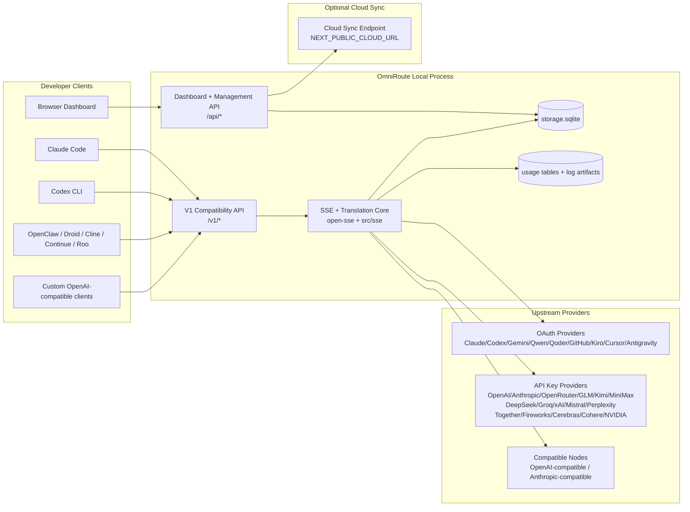
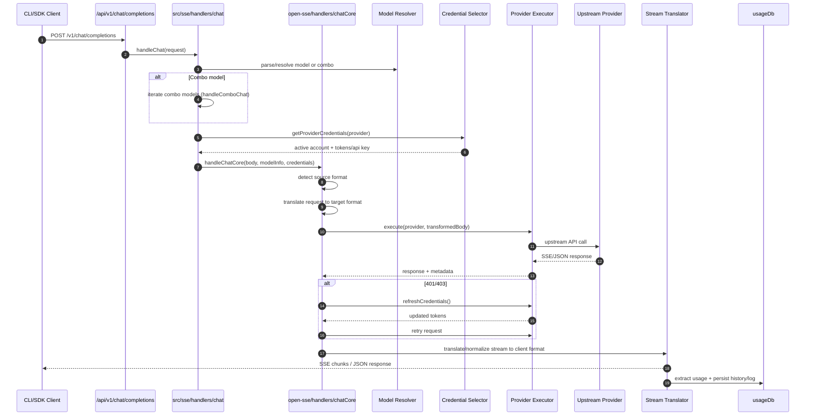
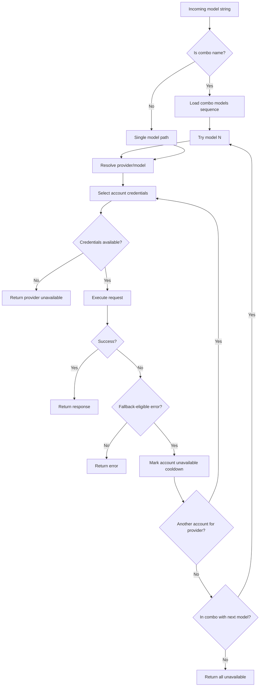
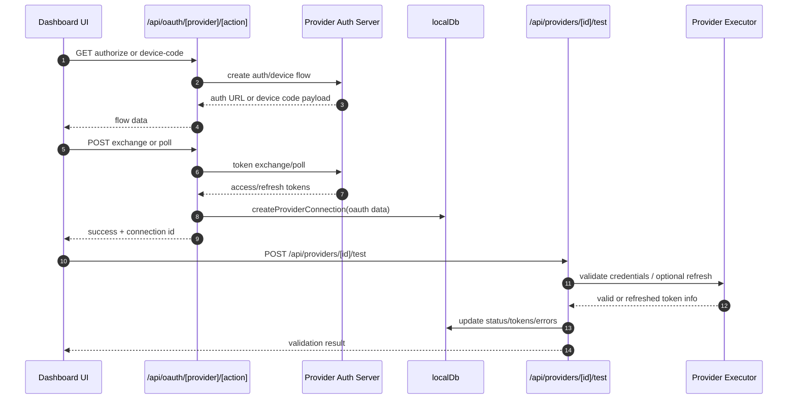
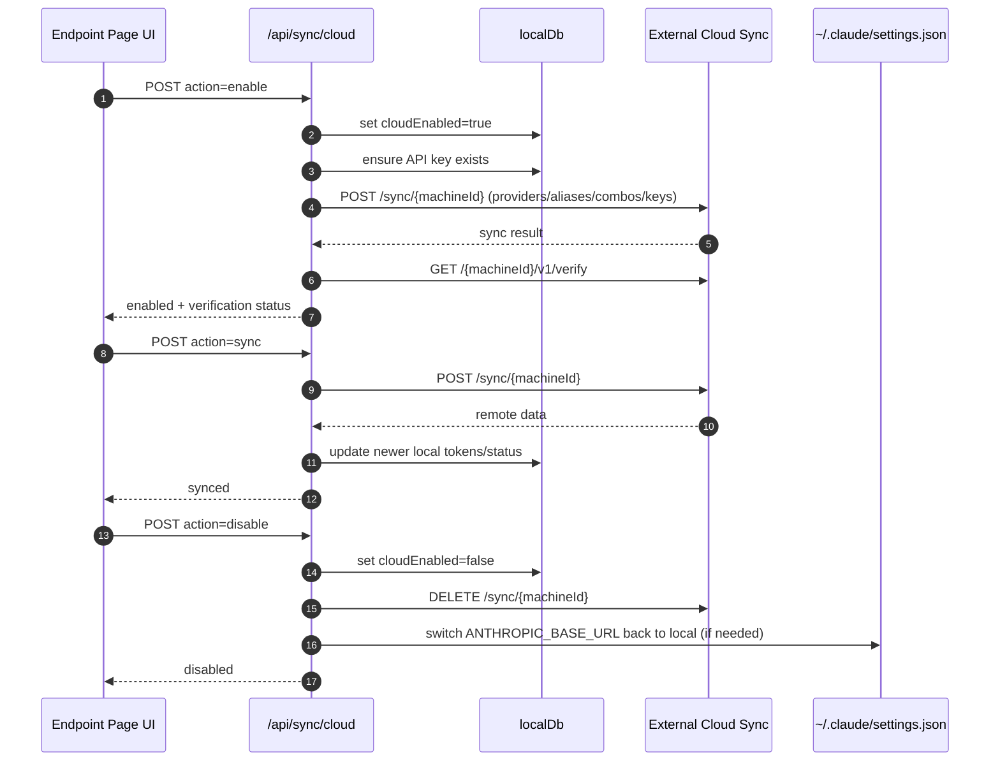
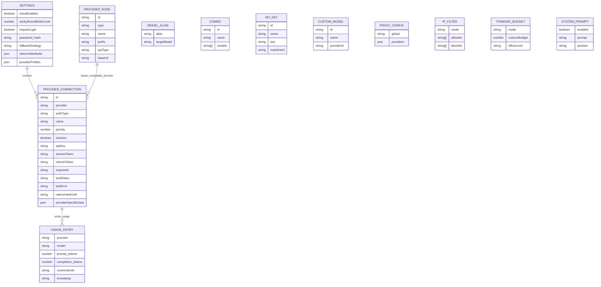
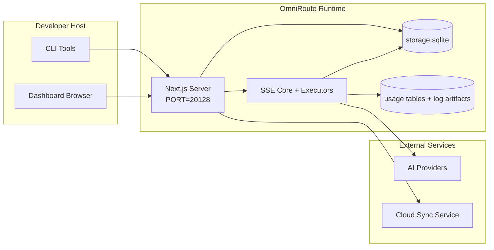

# OmniRoute 架构

🌐 **Languages:** 🇺🇸 [English](../../../../docs/ARCHITECTURE.md) · 🇸🇦 [ar](../../ar/docs/ARCHITECTURE.md) · 🇧🇬 [bg](../../bg/docs/ARCHITECTURE.md) · 🇧🇩 [bn](../../bn/docs/ARCHITECTURE.md) · 🇨🇿 [cs](../../cs/docs/ARCHITECTURE.md) · 🇩🇰 [da](../../da/docs/ARCHITECTURE.md) · 🇩🇪 [de](../../de/docs/ARCHITECTURE.md) · 🇪🇸 [es](../../es/docs/ARCHITECTURE.md) · 🇮🇷 [fa](../../fa/docs/ARCHITECTURE.md) · 🇫🇮 [fi](../../fi/docs/ARCHITECTURE.md) · 🇫🇷 [fr](../../fr/docs/ARCHITECTURE.md) · 🇮🇳 [gu](../../gu/docs/ARCHITECTURE.md) · 🇮🇱 [he](../../he/docs/ARCHITECTURE.md) · 🇮🇳 [hi](../../hi/docs/ARCHITECTURE.md) · 🇭🇺 [hu](../../hu/docs/ARCHITECTURE.md) · 🇮🇩 [id](../../id/docs/ARCHITECTURE.md) · 🇮🇹 [it](../../it/docs/ARCHITECTURE.md) · 🇯🇵 [ja](../../ja/docs/ARCHITECTURE.md) · 🇰🇷 [ko](../../ko/docs/ARCHITECTURE.md) · 🇮🇳 [mr](../../mr/docs/ARCHITECTURE.md) · 🇲🇾 [ms](../../ms/docs/ARCHITECTURE.md) · 🇳🇱 [nl](../../nl/docs/ARCHITECTURE.md) · 🇳🇴 [no](../../no/docs/ARCHITECTURE.md) · 🇵🇭 [phi](../../phi/docs/ARCHITECTURE.md) · 🇵🇱 [pl](../../pl/docs/ARCHITECTURE.md) · 🇵🇹 [pt](../../pt/docs/ARCHITECTURE.md) · 🇧🇷 [pt-BR](../../pt-BR/docs/ARCHITECTURE.md) · 🇷🇴 [ro](../../ro/docs/ARCHITECTURE.md) · 🇷🇺 [ru](../../ru/docs/ARCHITECTURE.md) · 🇸🇰 [sk](../../sk/docs/ARCHITECTURE.md) · 🇸🇪 [sv](../../sv/docs/ARCHITECTURE.md) · 🇰🇪 [sw](../../sw/docs/ARCHITECTURE.md) · 🇮🇳 [ta](../../ta/docs/ARCHITECTURE.md) · 🇮🇳 [te](../../te/docs/ARCHITECTURE.md) · 🇹🇭 [th](../../th/docs/ARCHITECTURE.md) · 🇹🇷 [tr](../../tr/docs/ARCHITECTURE.md) · 🇺🇦 [uk-UA](../../uk-UA/docs/ARCHITECTURE.md) · 🇵🇰 [ur](../../ur/docs/ARCHITECTURE.md) · 🇻🇳 [vi](../../vi/docs/ARCHITECTURE.md) · 🇨🇳 [zh-CN](../../zh-CN/docs/ARCHITECTURE.md)

---

_最后更新：2026-06-28_

## 概述

OmniRoute 是基于 Next.js 构建的本地 AI 路由网关和控制台。
它提供一个统一的 OpenAI 兼容端点（`/v1/*`），将流量路由至多个上游服务商，并支持格式转换、容灾、Token 刷新和用量追踪。

核心能力：

- OpenAI 兼容的 API 接口，供 CLI/工具使用（237 个服务商、68 个执行器）
- 跨服务商格式的请求/响应转换
- 模型 Combo 容灾（多模型序列）
- 结构化 Combo 步骤（`服务商 + 模型 + 连接`），通过 `compositeTiers` 在运行时排序
- 帐户级容灾（每服务商多帐户）
- 配额预检，以及主聊通路中基于配额感知的 P2C 帐户选择
- OAuth + API Key 服务商连接管理（17 个 OAuth 服务商模块）
- 通过 `/v1/embeddings` 生成向量嵌入（6 个服务商、9 个模型）
- 通过 `/v1/images/generations` 生成图片（10+ 个服务商、20+ 个模型）
- 通过 `/v1/audio/transcriptions` 进行音频转录（7 个服务商）
- 通过 `/v1/audio/speech` 进行文本转语音（10 个服务商）
- 通过 `/v1/videos/generations` 生成视频（ComfyUI + SD WebUI）
- 通过 `/v1/music/generations` 生成音乐（ComfyUI）
- 通过 `/v1/search` 进行网页搜索（5 个服务商）
- 通过 `/v1/moderations` 进行内容审核
- 通过 `/v1/rerank` 进行重排序
- 推理模型的 `<think>...</think>` 标签解析
- 响应净化，确保与 OpenAI SDK 严格兼容
- 角色归一化（developer→system, system→user），跨服务商兼容
- 结构化输出转换（json_schema → Gemini responseSchema）
- 服务商、API Key、别名、Combo、设置、定价的本地持久化（26 个 DB 模块）
- 用量/成本追踪和请求日志
- 可选的云端同步，支持多设备/状态同步
- IP 白名单/黑名单，控制 API 访问
- Thinking Budget 管理（passthrough/auto/custom/adaptive）
- 全局系统提示注入
- 会话追踪和指纹识别
- 增强的每帐户速率限制，含服务商专属配置
- 熔断器模式，保障服务商容灾
- 互斥锁防惊群效应保护
- 基于签名的请求去重缓存
- 域层：成本规则、容灾策略、锁定策略
- Context Relay：会话交接摘要，确保帐户轮换连续性
- 域状态持久化（基于 SQLite 的写穿式缓存，存储容灾、预算、锁定、熔断器状态）
- 策略引擎，集中评估请求（锁定 → 预算 → 容灾）
- 请求遥测，含 p50/p95/p99 延迟聚合
- Combo 目标遥测，以及通过 `combo_execution_key` / `combo_step_id` 记录 Combo 目标历史健康状态
- 关联 ID（X-Request-Id），支持端到端追踪
- 合规审计日志，支持按 API Key 选择退出
- 评估框架，用于 LLM 质量保证
- 健康看板，实时显示服务商熔断器状态
- MCP 服务端（87 个工具），支持 3 种传输方式（stdio/SSE/Streamable HTTP）
- A2A 服务端（JSON-RPC 2.0 + SSE），含技能和任务生命周期
- 记忆系统（提取、注入、检索、摘要）
- 技能系统（注册表、执行器、沙箱、内置技能）
- MITM 代理，含证书管理和 DNS 处理
- 提示注入防护中间件
- 提示压缩管线，含 Caveman、RTK、级联管线、压缩 Combo、语言包和分析
- ACP（Agent Communication Protocol）注册表
- 模块化 OAuth 服务商（`src/lib/oauth/providers/` 下 16 个独立模块）
- 卸载/完全卸载脚本
- OAuth 环境修复操作
- OpenAI 兼容 WebSocket 客户端的 WebSocket 桥接（`/v1/ws`）
- 同步 Token 管理（签发/撤销，基于 ETag 版本控制的配置包下载）
- GLM Thinking（`glmt`）一等服务商预设
- 混合 Token 计数（服务商侧 `/messages/count_tokens` + 估算容灾）
- 模型别名自动播种（启动时 30+ 跨代理方言归一化）
- 安全出站 fetch，含 SSRF 防护、私有 URL 拦截和可配置重试
- 冷却感知的聊重试机制，支持可配置的 `requestRetry` 和 `maxRetryIntervalSec`
- 启动时通过 Zod 进行运行时环境校验
- 合规审计 v2，含分页、服务商 CRUD 事件和 SSRF 拦截校验日志

主要运行时模型：

- `src/app/api/*` 下的 Next.js 应用路由同时实现控制台 API 和兼容 API
- `src/sse/*` + `open-sse/*` 中的共享 SSE/路由核心处理服务商执行、格式转换、流式传输、容灾和用量追踪

## 参考架构图

v3.8.0 平台的权威版本控制 Mermaid 源文件位于
[`docs/diagrams/`](../diagrams/README.md)。以下展示其中两幅以供概览；
其余图表可从各自领域指南中获取。


> 源文件：[diagrams/request-pipeline.mmd](../diagrams/request-pipeline.mmd)


> 源文件：[diagrams/resilience-3layers.mmd](../diagrams/resilience-3layers.mmd) — 另见
> [RESILIENCE_GUIDE.md](./RESILIENCE_GUIDE.md) 和 `CLAUDE.md` 中的容灾参考。

## 范围与边界

### 范围内

- 本地网关运行时
- 控制台管理 API
- 服务商认证与 Token 刷新
- 请求格式转换和 SSE 流式传输
- 本地状态 + 用量持久化
- 可选的云端同步编排

### 范围外

- `NEXT_PUBLIC_CLOUD_URL` 背后的云端服务实现
- 本地进程之外的服务商 SLA/控制面
- 外部 CLI 二进制程序本身（Claude Code、Codex CLI 等）

## 控制台界面（当前）

`src/app/(dashboard)/dashboard/` 下的主要页面：

- `/dashboard` — 快速开始 + 服务商概览
- `/dashboard/endpoint` — 端点代理 + MCP + A2A + API 端点标签页
- `/dashboard/providers` — 服务商连接和凭据
- `/dashboard/combos` — Combo 策略、模板、基于步骤的构建器、模型路由规则、手动持久化排序
- `/dashboard/auto-combo` — Auto Combo 引擎：评分权重、模式包、虚拟工厂预设、遥测
- `/dashboard/costs` — 成本聚合和定价可视化
- `/dashboard/analytics` — 用量分析、评估、Combo 目标健康状态
- `/dashboard/limits` — 配额/速率控制
- `/dashboard/cli-tools` — CLI 接入引导、运行时检测、配置生成
- `/dashboard/agents` — 已检测的 ACP 代理 + 自定义代理注册
- `/dashboard/cloud-agents` — 云端托管代理任务（Codex Cloud、Devin、Jules）和任务生命周期
- `/dashboard/skills` — A2A 技能注册表、沙箱执行、内置技能目录
- `/dashboard/memory` — 持久化会话记忆查看和检索
- `/dashboard/webhooks` — 出站 Webhook 订阅、密钥轮换、重试统计
- `/dashboard/batch` — 批量任务提交和进度
- `/dashboard/cache` — 读穿式缓存和推理缓存统计、淘汰控制
- `/dashboard/playground` — 针对任意配置 Combo/模型的交互式对话演练
- `/dashboard/changelog` — 应用内更新日志查看器（渲染 `CHANGELOG.md`）
- `/dashboard/system` — 运行时诊断、版本信息、环境校验界面
- `/dashboard/onboarding` — 新装首次运行设置向导
- `/dashboard/media` — 图片/视频/音乐演练
- `/dashboard/search-tools` — 搜索服务商测试和历史
- `/dashboard/health` — 运行时间、熔断器、速率限制、配额监控会话
- `/dashboard/logs` — 请求/代理/审计/控制台日志
- `/dashboard/settings` — 系统设置标签页（常规、路由、Combo 默认值等）
- `/dashboard/context/caveman` — Caveman 压缩规则、语言包、预览和输出模式
- `/dashboard/context/rtk` — RTK 命令输出过滤器、预览和运行时安全设置
- `/dashboard/context/combos` — 分配给路由 Combo 的命名压缩管线
- `/dashboard/translator` — 翻译器查看和请求格式转换预览
- `/dashboard/audit` — 合规审计日志浏览器，含分页和结构化元数据
- `/dashboard/usage` — 关联 `usage_history` 的每请求用量浏览器
- `/dashboard/compression` — 压缩分析、统计和管线分配
- `/dashboard/api-manager` — API Key 生命周期和模型权限

## 高层系统上下文



## 核心运行时组件

## 1) API 与路由层（Next.js App Routes）

主要目录：

- `src/app/api/v1/*` 和 `src/app/api/v1beta/*` — 兼容 API
- `src/app/api/*` — 管理/配置 API
- `next.config.mjs` 中的 Next.js 重写规则将 `/v1/*` 映射到 `/api/v1/*`

重要的兼容路由：

- `src/app/api/v1/chat/completions/route.ts`
- `src/app/api/v1/messages/route.ts`
- `src/app/api/v1/responses/route.ts`
- `src/app/api/v1/models/route.ts` — 包含标记为 `custom: true` 的自定义模型
- `src/app/api/v1/embeddings/route.ts` — 向量嵌入生成（6 个服务商）
- `src/app/api/v1/images/generations/route.ts` — 图片生成（4+ 个服务商，含 Antigravity/Nebius）
- `src/app/api/v1/messages/count_tokens/route.ts`
- `src/app/api/v1/providers/[provider]/chat/completions/route.ts` — 专用每服务商聊
- `src/app/api/v1/providers/[provider]/embeddings/route.ts` — 专用每服务商向量嵌入
- `src/app/api/v1/providers/[provider]/images/generations/route.ts` — 专用每服务商图片生成
- `src/app/api/v1beta/models/route.ts`
- `src/app/api/v1beta/models/[...path]/route.ts`

管理领域：

- 认证/设置：`src/app/api/auth/*`, `src/app/api/settings/*`
- 服务商/连接：`src/app/api/providers*`
- 服务商节点：`src/app/api/provider-nodes*`
- 自定义模型：`src/app/api/provider-models` (GET/POST/DELETE)
- 模型目录：`src/app/api/models/route.ts` (GET)
- 代理配置：`src/app/api/settings/proxy` (GET/PUT/DELETE) + `src/app/api/settings/proxy/test` (POST)
- OAuth：`src/app/api/oauth/*`
- API Key/别名/Combo/定价：`src/app/api/keys*`, `src/app/api/models/alias`, `src/app/api/combos*`, `src/app/api/pricing`
- 用量：`src/app/api/usage/*`
- 同步/云端：`src/app/api/sync/*`, `src/app/api/cloud/*`
- CLI 工具辅助：`src/app/api/cli-tools/*`
- IP 过滤：`src/app/api/settings/ip-filter` (GET/PUT)
- Thinking Budget：`src/app/api/settings/thinking-budget` (GET/PUT)
- 系统提示：`src/app/api/settings/system-prompt` (GET/PUT)
- 压缩：`src/app/api/settings/compression`, `src/app/api/compression/*` 和
  `src/app/api/context/*`
- 会话：`src/app/api/sessions` (GET)
- 速率限制：`src/app/api/rate-limits` (GET)
- 容灾：`src/app/api/resilience` (GET/PATCH) — 请求队列、连接冷却、服务商熔断器、等待冷却配置
- 容灾重置：`src/app/api/resilience/reset` (POST) — 重置服务商熔断器
- 缓存统计：`src/app/api/cache/stats` (GET/DELETE)
- 遥测：`src/app/api/telemetry/summary` (GET)
- 预算：`src/app/api/usage/budget` (GET/POST)
- 容灾链：`src/app/api/fallback/chains` (GET/POST/DELETE)
- 合规审计：`src/app/api/compliance/audit-log` (GET, 含分页 + 结构化元数据)
- 评估：`src/app/api/evals` (GET/POST), `src/app/api/evals/[suiteId]` (GET)
- 策略：`src/app/api/policies` (GET/POST)
- 同步 Token：`src/app/api/sync/tokens` (GET/POST), `src/app/api/sync/tokens/[id]` (GET/DELETE)
- 配置包：`src/app/api/sync/bundle` (GET, ETag 版本控制的设置/服务商/Combo/Key 快照)
- WebSocket：`src/app/api/v1/ws/route.ts` — OpenAI 兼容 WS 客户端的 Upgrade 处理

## 2) SSE + 格式转换核心

主流模块：

- 入口：`src/sse/handlers/chat.ts`
- 核心编排：`open-sse/handlers/chatCore.ts`
- 服务商执行适配器：`open-sse/executors/*`
- 格式检测/服务商配置：`open-sse/services/provider.ts`
- 模型解析/解析：`src/sse/services/model.ts`, `open-sse/services/model.ts`
- 帐户容灾逻辑：`open-sse/services/accountFallback.ts`
- 翻译器注册表：`open-sse/translator/index.ts`
- 流转换：`open-sse/utils/stream.ts`, `open-sse/utils/streamHandler.ts`
- 用量提取/归一化：`open-sse/utils/usageTracking.ts`
- Think 标签解析器：`open-sse/utils/thinkTagParser.ts`
- 向量嵌入处理器：`open-sse/handlers/embeddings.ts`
- 向量嵌入服务商注册表：`open-sse/config/embeddingRegistry.ts`
- 图片生成处理器：`open-sse/handlers/imageGeneration.ts`
- 图片服务商注册表：`open-sse/config/imageRegistry.ts`
- 响应净化：`open-sse/handlers/responseSanitizer.ts`
- 角色归一化：`open-sse/services/roleNormalizer.ts`

服务（业务逻辑）：

- 帐户选择/评分：`open-sse/services/accountSelector.ts`
- 上下文生命周期管理：`open-sse/services/contextManager.ts`
- IP 过滤执行：`open-sse/services/ipFilter.ts`
- 会话追踪：`open-sse/services/sessionManager.ts`
- 请求去重：`open-sse/services/signatureCache.ts`
- 系统提示注入：`open-sse/services/systemPrompt.ts`
- Thinking Budget 管理：`open-sse/services/thinkingBudget.ts`
- 通配符模型路由：`open-sse/services/wildcardRouter.ts`
- 速率限制管理：`open-sse/services/rateLimitManager.ts`
- 熔断器：`src/shared/utils/circuitBreaker.ts`
- 上下文交接：`open-sse/services/contextHandoff.ts` — 为 context-relay 策略生成和注入交接摘要
- 压缩：`open-sse/services/compression/*` — 在服务商翻译之前执行的主动压缩；
  含 Caveman 规则、RTK 过滤器、级联管线、压缩 Combo、统计和校验
- Codex 配额获取器：`open-sse/services/codexQuotaFetcher.ts` — 获取 Codex 配额，用于 context-relay 交接决策
- 冷却感知重试：`src/sse/services/cooldownAwareRetry.ts` — 每模型冷却重试，支持可配置的 `requestRetry` / `maxRetryIntervalSec`
- 安全出站 fetch：`src/shared/network/safeOutboundFetch.ts` — 带 SSRF 防护、私有 URL 拦截、重试和超时的服务商/模型 fetch
- 出站 URL 守卫：`src/shared/network/outboundUrlGuard.ts` — 校验服务商 URL 是否指向私有/localhost CIDR 范围
- 服务商请求默认值：`open-sse/services/providerRequestDefaults.ts` — 服务商级 `maxTokens`、`temperature`、`thinkingBudgetTokens` 默认值
- GLM 服务商常量：`open-sse/config/glmProvider.ts` — 共享 GLM 模型、配额 URL、GLMT 超时/默认值
- Antigravity 上游：`open-sse/config/antigravityUpstream.ts` — 基础 URL 和发现路径常量
- Codex 客户端常量：`open-sse/config/codexClient.ts` — 带版本号的 user-agent 和 client-version 值
- 模型别名播种：`src/lib/modelAliasSeed.ts` — 启动时播种 30+ 跨代理方言别名

域层模块：

- 成本规则/预算：`src/domain/costRules.ts`
- 容灾策略：`src/domain/fallbackPolicy.ts`
- Combo 解析器：`src/domain/comboResolver.ts`
- 锁定策略：`src/domain/lockoutPolicy.ts`
- 策略引擎：`src/domain/policyEngine.ts` — 集中式 锁定 → 预算 → 容灾 评估
- 错误码目录：`src/shared/constants/errorCodes.ts`
- 请求 ID：`src/shared/utils/requestId.ts`
- Fetch 超时：`src/shared/utils/fetchTimeout.ts`
- 请求遥测：`src/shared/utils/requestTelemetry.ts`
- 合规/审计：`src/lib/compliance/index.ts`
- 评估运行器：`src/lib/evals/evalRunner.ts`
- 域状态持久化：`src/lib/db/domainState.ts` — SQLite CRUD，管理容灾链、预算、成本历史、锁定状态、熔断器

OAuth 服务商模块（`src/lib/oauth/providers/` 下 16 个独立文件）：

- 注册表索引：`src/lib/oauth/providers/index.ts`
- 独立服务商：`claude.ts`, `codex.ts`, `gemini.ts`, `antigravity.ts`, `agy.ts`, `qoder.ts`, `qwen.ts`, `kimi-coding.ts`, `github.ts`, `kiro.ts`, `cursor.ts`, `kilocode.ts`, `cline.ts`, `windsurf.ts`, `gitlab-duo.ts`, `trae.ts`
- 薄封装层：`src/lib/oauth/providers.ts` — 从独立模块重新导出

## 5) 嵌入式服务（v3.8.4）

OmniRoute 可以安装、监管并路由到本地运行的 AI 工具进程，称为**嵌入式服务**。
v3.8.4 中发布了两项：9Router 和 CLIProxyAPI。

架构层级：

- **UI** (`/dashboard/providers/services`) — 双标签页页面，含生命周期控制、
  实时日志流式传输、API Key 管理，以及（针对 9Router）通过内部反向代理提供嵌入式原生 UI。
- **API** (`/api/services/{name}/*`) — 9Router 8 个端点，CLIProxyAPI 7 个端点，
  均归类为 **LOCAL_ONLY**（硬规则 #17）。共享的 `GET /api/services/[name]/logs`
  SSE 端点同时服务于两者。
- **监管进程** (`src/lib/services/`) — 泛型 `ServiceSupervisor` 类封装了
  `child_process.spawn`，持有一个 5 MB 环形缓冲区用于 SSE 日志流式传输、一个健康
  探测循环、一个原子操作锁，以及 SIGTERM→SIGKILL 优雅关闭流程。
  `bootstrap.ts` 在进程启动时自动配置所有已启用的服务。
- **服务商/执行器** (`open-sse/executors/ninerouter.ts`) — 9Router 作为
  真实服务商对外暴露。模型前缀为 `9router/{sub}/{model}`，每 5 分钟从 9Router 的
  `/v1/models` 端点同步一次。

深入阅读：`docs/frameworks/EMBEDDED-SERVICES.md`

## 主要子系统（v3.8.0）

### A. Auto Combo 引擎

Auto Combo 在请求时动态评分和选择路由目标，而非依赖静态的 Combo 定义。
它驱动 `auto/*` 模型前缀系列。

- 引擎入口：`open-sse/services/autoCombo/`（`autoComboEngine.ts`、
  `scoringEngine.ts`、`virtualFactory.ts`、`modePacks.ts`）
- 解析器：`src/domain/comboResolver.ts`（自动检测 `auto/` 前缀）
- 控制台页面：`/dashboard/auto-combo`
- 遥测：`auto_combo_decisions` SQLite 表

关键能力：

- **17 种路由策略**（priority, weighted, fill-first, round-robin, P2C, random,
  least-used, cost-optimized, reset-aware, reset-window, headroom, strict-random,
  **auto**, lkgp, context-optimized, context-relay, **fusion**，外加一条容灾路径）—
  auto 是 v3.8.0 的重点新增策略；`fusion`（panel 分散请求 + judge 合成，
  `open-sse/services/fusion.ts`）是 v3.8.36 新增。
- **9 个评分因子**：成本、p95 延迟、成功率、配额余量、锁定距离、
  熔断器状态、近期失败次数、模型可用性、标签亲和度。
- **虚拟工厂**在不存在匹配的命名 Combo 时，从健康的活跃服务商连接
  中实时构建临时 Combo。
- **Auto 前缀**：`auto/coding`、`auto/cheap`、`auto/fast`、`auto/offline`、
  `auto/smart`、`auto/lkgp` — 各自由一个调优过的权重配置支持。
- **4 个模式包**：coding、fast、cheap、smart — 作为预设权重
  配置发布，可从控制台调用。

完整算法细节（因子公式、权重调优）参见
[`docs/routing/AUTO-COMBO.md`](../routing/AUTO-COMBO.md)。

### B. 云代理

Cloud Agents 将第三方托管代码代理平台（Codex Cloud、Devin、
Jules）封装在统一的基于 DB 的任务生命周期之后。所有任务创建/查看
端点均需要管理认证。

- 模块根目录：`src/lib/cloudAgent/`（`baseAgent.ts`、`registry.ts`、`api.ts`、
  `types.ts`、`db.ts`，以及 `agents/` 下每个代理的子目录）
- 每代理实现：`agents/codex/`、`agents/devin/`、`agents/jules/`
- 公开端点：`/api/v1/agents/tasks/*`（list/create/get/cancel）
- 管理端点：`/api/cloud/*`（配置、状态、批量）
- 控制台页面：`/dashboard/cloud-agents`
- 存储：`cloud_agent_tasks` 表

每代理配置和 OAuth 细节参见
[`docs/frameworks/CLOUD_AGENT.md`](../frameworks/CLOUD_AGENT.md)。

### C. 安全护栏

安全护栏模块是一个热重载的中间件层，检查请求
和响应中的 PII、提示注入和不安全视觉内容。违规
通过 HTTP **503** 加上结构化错误码立即拦截请求，
下游调用方可以据此重试或分支处理。

- 模块根目录：`src/lib/guardrails/`（`base.ts`、`registry.ts`、`piiMasker.ts`、
  `promptInjection.ts`、`visionBridge.ts`、`visionBridgeHelpers.ts`）
- 热重载：注册表监控配置变更并在原地重建处理链
- 接入点：聊处理器入口、图片生成处理器、响应净化器
- HTTP 协议：违规以 `503` + `error.code = "GUARDRAIL_VIOLATION"` 呈现

规则集编写和阈值调优参见
[`docs/security/GUARDRAILS.md`](../security/GUARDRAILS.md)。

### D. 域层

`src/domain/` 命名空间集中管理策略决策，路由处理器无需自行
处理锁定/预算/容灾逻辑。

- 策略引擎：`src/domain/policyEngine.ts` — 统一入口，
  执行前评估（锁定 → 预算 → 容灾排序）
- 成本规则：`src/domain/costRules.ts`
- 容灾策略：`src/domain/fallbackPolicy.ts`
- 锁定策略：`src/domain/lockoutPolicy.ts`
- 标签路由：`src/domain/tagRouter.ts`
- Combo 解析器：`src/domain/comboResolver.ts` — 将 Combo 名称、auto/* 前缀
  和通配符模型目标解析为具体执行计划
- 连接/模型规则连接器：`src/domain/connectionModelRules.ts`
- 模型可用性快照：`src/domain/modelAvailability.ts`
- 服务商过期追踪：`src/domain/providerExpiration.ts`
- 配额缓存：`src/domain/quotaCache.ts`
- 降级状态：`src/domain/degradation.ts`
- 配置审计：`src/domain/configAudit.ts`
- OmniRoute 响应元数据构建器：`src/domain/omnirouteResponseMeta.ts`
- 评估子系统：`src/domain/assessment/` — 周期性评估任务

### E. 授权管线

授权管线对每个进入的请求进行分类，并在分发前应用
相应的策略链。

- 管线入口：`src/server/authz/pipeline.ts`
- 请求分类器：`src/server/authz/classify.ts` — 区分公开兼容路由和管理路由
- 公开路由清单：`src/shared/constants/publicApiRoutes.ts`
- 策略：`src/server/authz/policies/` — 可组合的断言条件
  （`requireApiKey`、`requireManagement`、`requireFreshAuth` 等）
- Header 工具：`src/server/authz/headers.ts`
- 断言辅助：`src/server/authz/assertAuth.ts`
- 请求上下文：`src/server/authz/context.ts`

公开路由和管理路由之间是硬边界：代理/冷却 API 和
服务商变更操作要求管理认证（缺失时返回 HTTP 401）。

完整路由分类规则参见
[`docs/architecture/AUTHZ_GUIDE.md`](./AUTHZ_GUIDE.md)。

### F. 工作流 FSM 与任务感知路由器

在 Combo 选择之上叠加的有限状态机驱动路由器，
根据检测到的工作流阶段（规划、执行、
审核）和后台任务亲和度引导流量走向。

- 工作流 FSM：`open-sse/services/workflowFSM.ts`
- 任务感知路由器：`open-sse/services/taskAwareRouter.ts`
- 后台任务检测器：`open-sse/services/backgroundTaskDetector.ts`
- 意图分类器：`open-sse/services/intentClassifier.ts`

FSM 状态转换反馈到 Auto Combo 的评分中，使后台/自动化任务偏向
更便宜的模型，交互式规划/审核轮次偏向更强的模型。

### G. 服务商专属容灾

多个服务商内置了专用的容灾和隐身模块，这些模块
基于全局熔断器 / 连接冷却 / 模型锁定层运行：

- Antigravity 429 引擎：`open-sse/services/antigravity429Engine.ts`（轮换
  身份、清洗响应头，通过 `antigravityCredits.ts`、`antigravityHeaderScrub.ts`、
  `antigravityHeaders.ts`、`antigravityIdentity.ts`、`antigravityObfuscation.ts`、
  `antigravityVersion.ts` 驱动积分/版本追踪）
- ModelScope 配额策略：`open-sse/services/modelscopePolicy.ts`
- Claude Code CCH（兼容通道握手）：`open-sse/services/claudeCodeCCH.ts`，
  外加 `claudeCodeCompatible.ts`、`claudeCodeConstraints.ts`、`claudeCodeExtraRemap.ts`、
  `claudeCodeToolRemapper.ts`
- Claude Code 指纹塑造：`open-sse/services/claudeCodeFingerprint.ts`
- Claude Code 混淆：`open-sse/services/claudeCodeObfuscation.ts`
- ChatGPT TLS 客户端：`open-sse/services/chatgptTlsClient.ts`（为 ChatGPT-Web 会话
  提供 curl-impersonate 风格的 TLS 指纹）
- ChatGPT 图片缓存：`open-sse/services/chatgptImageCache.ts`

完整隐身策略和操作指南参见
[`docs/security/STEALTH_GUIDE.md`](../security/STEALTH_GUIDE.md)。

### H. Webhook、推理缓存、读缓存

- **Webhook** — 服务商/帐户/任务事件的出站分发。
  - 分发器：`src/lib/webhookDispatcher.ts`
  - 存储：`webhooks` SQLite 表（通过 `src/lib/db/webhooks.ts`）
  - 控制台页面：`/dashboard/webhooks`（订阅、密钥、重试历史）
  - 事件分类和重试语义参见 [`docs/frameworks/WEBHOOKS.md`](../frameworks/WEBHOOKS.md)。
- **推理缓存** — 对生成思考 Token 的服务商（Claude、GLMT 等）
  保存可回放的推理块，让连续轮次可以跳过重新思考。
  - DB 层：`src/lib/db/reasoningCache.ts`
  - 服务层：`open-sse/services/reasoningCache.ts`
  - 回放语义参见 [`docs/routing/REASONING_REPLAY.md`](../routing/REASONING_REPLAY.md)。
- **读缓存** — 按签名索引的短生命周期响应缓存，用于
  消除上游 SDK 的错误重复请求。
  - DB 层：`src/lib/db/readCache.ts`
  - 统计端点：`GET /api/cache/stats`，控制台页面 `/dashboard/cache`

## 3) 持久化层

主状态数据库（SQLite）：

- 核心基础设施：`src/lib/db/core.ts`（better-sqlite3、数据迁移、WAL）
- 重新导出门面：`src/lib/localDb.ts`（供调用方使用的薄兼容层）
- 文件：`${DATA_DIR}/storage.sqlite`（或设置了 `$XDG_CONFIG_HOME` 时为 `$XDG_CONFIG_HOME/omniroute/storage.sqlite`，否则为 `~/.omniroute/storage.sqlite`）
- 实体（表 + KV 命名空间）：providerConnections, providerNodes, modelAliases, combos, apiKeys, settings, pricing, **customModels**, **proxyConfig**, **ipFilter**, **thinkingBudget**, **systemPrompt**

用量持久化：

- 门面：`src/lib/usageDb.ts`（拆解后的模块位于 `src/lib/usage/*`）
- `storage.sqlite` 中的 SQLite 表：`usage_history`、`call_logs`、`proxy_logs`
- 可选的文件工件保留以便兼容/调试（`${DATA_DIR}/log.txt`、`${DATA_DIR}/call_logs/`、`<repo>/logs/...`）
- 存在旧 JSON 文件时，启动迁移会将其迁移到 SQLite

域状态数据库（SQLite）：

- `src/lib/db/domainState.ts` — 域状态的 CRUD 操作
- 表（在 `src/lib/db/core.ts` 中创建）：`domain_fallback_chains`、`domain_budgets`、`domain_cost_history`、`domain_lockout_state`、`domain_circuit_breakers`
- 写穿式缓存模式：运行时以内存 Map 为权威数据源；变更同步写入 SQLite；冷启动时从数据库恢复状态

## 4) 认证与安全界面

- 控制台 Cookie 认证：`src/proxy.ts`、`src/app/api/auth/login/route.ts`
- API Key 生成/验证：`src/shared/utils/apiKey.ts`
- 服务商密钥持久化存储在 `providerConnections` 条目中
- 出站代理支持：`open-sse/utils/proxyFetch.ts`（环境变量）和 `open-sse/utils/networkProxy.ts`（可按服务商或全局配置）
- SSRF / 出站 URL 守卫：`src/shared/network/outboundUrlGuard.ts` — 拦截所有服务商调用的私有/loopback/本地链路范围目标
- 运行时环境校验：`src/lib/env/runtimeEnv.ts` — 用于所有环境变量的 Zod Schema，在启动时以错误/警告形式呈现
- 同步 Token：`src/lib/db/syncTokens.ts` — 为配置包下载端点签发的带权限域 Token；后端使用 `sync_tokens` SQLite 表（迁移文件 `024_create_sync_tokens.sql`）
- WebSocket 握手认证：`src/lib/ws/handshake.ts` — 通过 API Key 或会话 Cookie 校验 WS 升级请求

## 5) 云端同步

- 调度器初始化：`src/lib/initCloudSync.ts`、`src/shared/services/initializeCloudSync.ts`、`src/shared/services/modelSyncScheduler.ts`
- 周期任务：`src/shared/services/cloudSyncScheduler.ts`
- 周期任务：`src/shared/services/modelSyncScheduler.ts`
- 控制路由：`src/app/api/sync/cloud/route.ts`

## 请求生命周期 (`/v1/chat/completions`)



## Combo + 帐户容灾流程



容灾决策由 `open-sse/services/accountFallback.ts` 根据状态码和错误消息启发式算法驱动。Combo 路由增加了一层额外保护：服务商级 400 错误（如上游内容拦截和角色校验失败）会被视为模型局部故障，后续 Combo 目标仍可继续执行。

## OAuth 接入和 Token 刷新生命周期



实时流量中的 Token 刷新在 `open-sse/handlers/chatCore.ts` 内通过执行器的 `refreshCredentials()` 完成。

## 云端同步生命周期（启用 / 同步 / 禁用）



当云端同步启用时，由 `CloudSyncScheduler` 触发周期同步。

## 数据模型与存储映射



物理存储文件：

- 主运行时数据库：`${DATA_DIR}/storage.sqlite`
- 请求日志行：`${DATA_DIR}/log.txt`（兼容/调试工件）
- 结构化调用载荷存档：`${DATA_DIR}/call_logs/`
- 可选的翻译器/请求调试会话：`<repo>/logs/...`

## 部署拓扑



## 模块映射（决策关键）

### 路由与 API 模块

- `src/app/api/v1/*`、`src/app/api/v1beta/*`：兼容 API
- `src/app/api/v1/providers/[provider]/*`：专用每服务商路由（聊、向量嵌入、图片）
- `src/app/api/providers*`：服务商 CRUD、校验、测试
- `src/app/api/provider-nodes*`：自定义兼容节点管理
- `src/app/api/provider-models`：自定义模型管理（CRUD）
- `src/app/api/models/route.ts`：模型目录 API（别名 + 自定义模型）
- `src/app/api/oauth/*`：OAuth/设备码流程
- `src/app/api/keys*`：本地 API Key 生命周期
- `src/app/api/models/alias`：别名管理
- `src/app/api/combos*`：容灾 Combo 管理
- `src/app/api/pricing`：成本计算的定价覆盖
- `src/app/api/settings/proxy`：代理配置 (GET/PUT/DELETE)
- `src/app/api/settings/proxy/test`：出站代理连通性测试 (POST)
- `src/app/api/usage/*`：用量和日志 API
- `src/app/api/sync/*` + `src/app/api/cloud/*`：云端同步和云端辅助
- `src/app/api/cli-tools/*`：本地 CLI 配置写入/检查
- `src/app/api/settings/ip-filter`：IP 白名单/黑名单 (GET/PUT)
- `src/app/api/settings/thinking-budget`：思考 Token 预算配置 (GET/PUT)
- `src/app/api/settings/system-prompt`：全局系统提示 (GET/PUT)
- `src/app/api/settings/compression`：全局压缩设置 (GET/PUT)
- `src/app/api/compression/*`：压缩预览、规则元数据和语言包
- `src/app/api/context/caveman/config`：Caveman 设置别名 (GET/PUT)
- `src/app/api/context/rtk/*`：RTK 配置、过滤器目录、测试端点、原始输出恢复
- `src/app/api/context/combos*`：压缩 Combo CRUD 和路由 Combo 分配
- `src/app/api/context/analytics`：压缩分析别名
- `src/app/api/sessions`：活跃会话列表 (GET)
- `src/app/api/rate-limits`：每帐户速率限制状态 (GET)
- `src/app/api/sync/tokens`：同步 Token CRUD (GET/POST)
- `src/app/api/sync/tokens/[id]`：同步 Token 获取/删除 (GET/DELETE)
- `src/app/api/sync/bundle`：配置包下载 (GET, ETag 版本控制)
- `src/app/api/v1/ws`：OpenAI 兼容 WS 客户端的 WebSocket 升级处理

### 路由与执行核心

- `src/sse/handlers/chat.ts`：请求解析、Combo 处理、帐户选择循环
- `open-sse/handlers/chatCore.ts`：格式转换、执行器分发、重试/刷新处理、流设置

### 翻译器注册表与格式转换器

- `open-sse/translator/index.ts`：翻译器注册表与编排
- 请求翻译器：`open-sse/translator/request/*`（9 个模块 — `antigravity-to-openai`、`claude-to-gemini`、`claude-to-openai`、`gemini-to-openai`、`openai-responses`、`openai-to-claude`、`openai-to-cursor`、`openai-to-gemini`、`openai-to-kiro`）
- 响应翻译器：`open-sse/translator/response/*`（8 个模块 — `claude-to-openai`、`cursor-to-openai`、`gemini-to-claude`、`gemini-to-openai`、`kiro-to-openai`、`openai-responses`、`openai-to-antigravity`、`openai-to-claude`）
- 辅助模块：`open-sse/translator/helpers/*`（8 个模块 — `claudeHelper`、`geminiHelper`、`geminiToolsSanitizer`、`maxTokensHelper`、`openaiHelper`、`responsesApiHelper`、`schemaCoercion`、`toolCallHelper`）
- 格式常量：`open-sse/translator/formats.ts`
- 启动加载与注册表：`open-sse/translator/bootstrap.ts`、`open-sse/translator/registry.ts`
- 图片格式辅助：`open-sse/translator/image/`

### 持久化

- `src/lib/db/*`：SQLite 上的持久化配置/状态和域持久化
- `src/lib/localDb.ts`：DB 模块的兼容性重新导出
- `src/lib/usageDb.ts`：SQLite 表之上的用量历史/调用日志门面

## 服务商执行器覆盖（策略模式）

每个服务商都有一个继承 `BaseExecutor`（在 `open-sse/executors/base.ts` 中）的专用执行器，该基类提供了 URL 构建、Header 构造、带指数退避的重试、凭据刷新钩子以及 `execute()` 编排方法。

| 执行器                     | 服务商                                                                                                                                                       | 特殊处理                                          |
| ------------------------ | ----------------------------------------------------------------------------------------------------------------------------------------------------------- | ------------------------------------------------- |
| `DefaultExecutor`        | OpenAI, Claude, Gemini, Qwen, OpenRouter, GLM, Kimi, MiniMax, DeepSeek, Groq, xAI, Mistral, Perplexity, Together, Fireworks, Cerebras, Cohere, NVIDIA 等    | 每服务商动态 URL/Header 配置                       |
| `AntigravityExecutor`    | Google Antigravity                                                                                                                                          | 自定义项目/会话 ID、Retry-After 解析、429 混淆     |
| `AzureOpenAIExecutor`    | Azure OpenAI                                                                                                                                                | 基于部署的路由、api-version 查询参数强制执行       |
| `BlackboxWebExecutor`    | Blackbox AI (web-mode)                                                                                                                                      | Web 会话反向 + TLS 指纹模拟                        |
| `ChatGPTWebExecutor`     | ChatGPT web                                                                                                                                                 | TLS 客户端 + 会话 Cookie 管理（`chatgptTlsClient.ts`）|
| `ClaudeIdentityExecutor` | Claude.ai (CCH 通道)                                                                                                                                        | 约束 + Tool 重映射管线、指纹塑造                   |
| `CliProxyApiExecutor`    | CLIProxyAPI 兼容服务商                                                                                                                                      | 自定义认证和协议处理                               |
| `CloudflareAiExecutor`   | Cloudflare Workers AI                                                                                                                                       | 帐户 ID 注入、基于 Neurons 的用量追踪              |
| `CodexExecutor`          | OpenAI Codex                                                                                                                                                | 注入系统指令、强制推理力度                          |
| `CommandCodeExecutor`    | Command Code                                                                                                                                                | OAuth + 每会话 Header 轮换                         |
| `CursorExecutor`         | Cursor IDE                                                                                                                                                  | ConnectRPC 协议、Protobuf 编码、基于校验和的请求签名|
| `DevinCliExecutor`       | Devin CLI                                                                                                                                                   | Devin 任务生命周期桥接（通过云代理模块）            |
| `GithubExecutor`         | GitHub Copilot                                                                                                                                              | Copilot Token 刷新、VSCode 模仿 Header             |
| `GitlabExecutor`         | GitLab Duo                                                                                                                                                  | GitLab OAuth + 项目级路由                          |
| `GlmExecutor`            | Z.AI GLM（含 `glmt` 预设）                                                                                                                                  | Thinking Budget 感知、GLMT 预设常量                |
| `GrokWebExecutor`        | xAI Grok web                                                                                                                                                | Web 会话反向、模式选择（think/standard）            |
| `KieExecutor`            | KIE                                                                                                                                                         | 自定义 Token 签发 + 轮换会话锚点                   |
| `KiroExecutor`           | AWS CodeWhisperer/Kiro                                                                                                                                      | AWS EventStream 二进制格式 → SSE 转换              |
| `MuseSparkWebExecutor`   | Muse Spark (web)                                                                                                                                            | Web 会话反向 + 图片消息桥接                        |
| `NlpCloudExecutor`       | NLP Cloud                                                                                                                                                   | 服务商专属请求体形状                               |
| `OpenCodeExecutor`       | OpenCode                                                                                                                                                    | AI SDK 兼容服务商初始化                            |
| `PerplexityWebExecutor`  | Perplexity web                                                                                                                                              | Web 会话反向，用于聊延续                            |
| `PetalsExecutor`         | Petals distributed inference                                                                                                                                | 去中心化集群路由                                   |
| `PollinationsExecutor`   | Pollinations AI                                                                                                                                             | 无需 API Key、带速率限制的请求                     |
| `PuterExecutor`          | Puter                                                                                                                                                       | 基于浏览器的服务商集成                             |
| `QoderExecutor`          | Qoder AI                                                                                                                                                    | PAT 和 OAuth 支持、多模型免费层                    |
| `VertexExecutor`         | Google Vertex AI                                                                                                                                            | 服务帐户认证、基于区域的端点                       |
| `WindsurfExecutor`       | Windsurf (Codeium)                                                                                                                                          | Codeium OAuth + 会话 Token 刷新                    |

其余所有服务商（含自定义兼容节点）使用 `DefaultExecutor`。

## 服务商兼容性矩阵

> **注意：** 下表是 OmniRoute v3.8.0 中 237 个已注册服务商的代表性样本。
> 完整且持续更新的列表请参阅
> [`docs/reference/PROVIDER_REFERENCE.md`](../reference/PROVIDER_REFERENCE.md)（自动生成）或数据源头
> `src/shared/constants/providers.ts`（加载时通过 Zod 校验）。

| 服务商             | 格式              | 认证                   | 流式           | 非流式     | Token 刷新  | 用量 API          |
| ----------------- | ---------------- | --------------------- | -------------- | ---------- | ----------- | ----------------- |
| Claude            | claude           | API Key / OAuth       | ✅             | ✅         | ✅          | ⚠️ 仅管理员        |
| Gemini            | gemini           | API Key / OAuth       | ✅             | ✅         | ✅          | ⚠️ Cloud Console   |
| Antigravity       | antigravity      | OAuth                 | ✅             | ✅         | ✅          | ✅ 完整配额 API    |
| OpenAI            | openai           | API Key               | ✅             | ✅         | ❌          | ❌                 |
| Codex             | openai-responses | OAuth                 | ✅ 强制         | ❌         | ✅          | ✅ 速率限制        |
| GitHub Copilot    | openai           | OAuth + Copilot Token | ✅             | ✅         | ✅          | ✅ 配额快照        |
| Cursor            | cursor           | 自定义校验和           | ✅             | ✅         | ❌          | ❌                 |
| Kiro              | kiro             | AWS SSO OIDC          | ✅ (EventStream)| ❌         | ✅          | ✅ 用量限制        |
| Qwen              | openai           | OAuth                 | ✅             | ✅         | ✅          | ⚠️ 每请求          |
| Qoder             | openai           | OAuth / PAT           | ✅             | ✅         | ✅          | ⚠️ 每请求          |
| Kilo Code         | openai           | OAuth                 | ✅             | ✅         | ✅          | ❌                 |
| Cline             | openai           | OAuth                 | ✅             | ✅         | ✅          | ❌                 |
| Kimi Coding       | openai           | OAuth                 | ✅             | ✅         | ✅          | ❌                 |
| OpenRouter        | openai           | API Key               | ✅             | ✅         | ❌          | ❌                 |
| GLM/Kimi/MiniMax  | claude           | API Key               | ✅             | ✅         | ❌          | ❌                 |
| DeepSeek          | openai           | API Key               | ✅             | ✅         | ❌          | ❌                 |
| Groq              | openai           | API Key               | ✅             | ✅         | ❌          | ❌                 |
| xAI (Grok)        | openai           | API Key               | ✅             | ✅         | ❌          | ❌                 |
| Mistral           | openai           | API Key               | ✅             | ✅         | ❌          | ❌                 |
| Perplexity        | openai           | API Key               | ✅             | ✅         | ❌          | ❌                 |
| Together AI       | openai           | API Key               | ✅             | ✅         | ❌          | ❌                 |
| Fireworks AI      | openai           | API Key               | ✅             | ✅         | ❌          | ❌                 |
| Cerebras          | openai           | API Key               | ✅             | ✅         | ❌          | ❌                 |
| Cohere            | openai           | API Key               | ✅             | ✅         | ❌          | ❌                 |
| NVIDIA NIM        | openai           | API Key               | ✅             | ✅         | ❌          | ❌                 |
| Cloudflare AI     | openai           | API Token + 帐户 ID    | ✅             | ✅         | ❌          | ❌                 |
| Pollinations      | openai           | 无需密钥                | ✅             | ✅         | ❌          | ❌                 |
| Scaleway AI       | openai           | API Key               | ✅             | ✅         | ❌          | ❌                 |
| LongCat           | openai           | API Key               | ✅             | ✅         | ❌          | ❌                 |
| Ollama Cloud      | openai           | API Key（可选）         | ✅             | ✅         | ❌          | ❌                 |
| HuggingFace       | openai           | API Key               | ✅             | ✅         | ❌          | ❌                 |
| Nebius            | openai           | API Key               | ✅             | ✅         | ❌          | ❌                 |
| SiliconFlow       | openai           | API Key               | ✅             | ✅         | ❌          | ❌                 |
| Hyperbolic        | openai           | API Key               | ✅             | ✅         | ❌          | ❌                 |
| Vertex AI         | gemini           | 服务帐户               | ✅             | ✅         | ✅          | ⚠️ Cloud Console   |
| Puter             | openai           | API Key               | ✅             | ✅         | ❌          | ❌                 |
| Command Code      | openai           | OAuth                 | ✅             | ✅         | ✅          | ⚠️ 每请求          |
| Z.AI / GLM        | openai           | API Key / OAuth       | ✅             | ✅         | ❌          | ❌                 |
| GLMT (preset)     | claude           | API Key               | ✅             | ✅         | ❌          | ⚠️ 每请求          |
| Kimi Coding       | openai           | OAuth / API Key       | ✅             | ✅         | ✅          | ❌                 |
| KIE               | openai           | API Key               | ✅             | ✅         | ❌          | ❌                 |
| Windsurf          | openai           | OAuth (Codeium)       | ✅             | ✅         | ✅          | ⚠️ 每请求          |
| GitLab Duo        | openai           | OAuth (GitLab)        | ✅             | ✅         | ✅          | ❌                 |
| Devin CLI         | openai           | OAuth                 | ✅             | ✅         | ✅          | ✅ 任务 API        |
| Codex Cloud       | openai-responses | OAuth                 | ✅             | ❌         | ✅          | ✅ 速率限制        |
| Jules             | openai           | OAuth                 | ✅             | ✅         | ✅          | ✅ 任务 API        |
| AgentRouter       | openai           | API Key               | ✅             | ✅         | ❌          | ❌                 |
| ChatGPT-Web       | openai           | 会话 Cookie + TLS      | ✅             | ✅         | ❌          | ❌                 |
| Grok-Web          | openai           | 会话 Cookie            | ✅             | ✅         | ❌          | ❌                 |
| Perplexity-Web    | openai           | 会话 Cookie            | ✅             | ✅         | ❌          | ❌                 |
| BlackBox-Web      | openai           | 会话 Cookie + TLS      | ✅             | ✅         | ❌          | ❌                 |
| Muse-Spark-Web    | openai           | 会话 Cookie            | ✅             | ✅         | ❌          | ❌                 |
| ModelScope        | openai           | API Key               | ✅             | ✅         | ❌          | ⚠️ 配额策略        |
| BazaarLink        | openai           | API Key               | ✅             | ✅         | ❌          | ❌                 |
| Petals            | openai           | 无需密钥                | ✅             | ✅         | ❌          | ❌                 |
| Qoder             | openai           | OAuth / PAT           | ✅             | ✅         | ✅          | ⚠️ 每请求          |
| OpenCode (Go/Zen) | openai           | OAuth                 | ✅             | ✅         | ✅          | ❌                 |
| CLIProxyAPI       | openai           | 自定义                  | ✅             | ✅         | ❌          | ❌                 |

## 格式转换覆盖

检测到的源格式包括：

- `openai`
- `openai-responses`
- `claude`
- `gemini`

目标格式包括：

- OpenAI chat/Responses
- Claude
- Gemini/Antigravity 封装
- Kiro
- Cursor

格式转换采用 **OpenAI 作为中枢格式** — 所有转换都经过 OpenAI 作为中间格式：

```
源格式 → OpenAI（中枢）→ 目标格式
```

格式转换根据源载荷形态和服务商目标格式动态选择。

格式转换管线中的额外处理层：

- **响应净化** — 从 OpenAI 格式响应中剥离非标准字段（流式和非流式），确保严格的 SDK 兼容性
- **角色归一化** — 将 `developer` 转换为 `system`（面向非 OpenAI 目标）；将 `system` 合并为 `user`（针对拒绝 system 角色的模型，如 GLM、ERNIE）
- **Think 标签提取** — 将内容中的 `<think>...</think>` 块解析为 `reasoning_content` 字段
- **结构化输出** — 将 OpenAI 的 `response_format.json_schema` 转换为 Gemini 的 `responseMimeType` + `responseSchema`

## 支持的 API 端点

| 端点                                                | 格式               | 处理器                                                             |
| --------------------------------------------------- | ------------------ | ----------------------------------------------------------------- |
| `POST /v1/chat/completions`                        | OpenAI Chat        | `src/sse/handlers/chat.ts`                                        |
| `POST /v1/messages`                                | Claude Messages    | 同一处理器（自动检测）                                              |
| `POST /v1/responses`                               | OpenAI Responses   | `open-sse/handlers/responsesHandler.ts`                           |
| `POST /v1/embeddings`                              | OpenAI Embeddings  | `open-sse/handlers/embeddings.ts`                                 |
| `GET /v1/embeddings`                               | 模型列表            | API 路由                                                          |
| `POST /v1/images/generations`                      | OpenAI Images      | `open-sse/handlers/imageGeneration.ts`                            |
| `GET /v1/images/generations`                       | 模型列表            | API 路由                                                          |
| `POST /v1/providers/{provider}/chat/completions`   | OpenAI Chat        | 带模型校验的专用每服务商路由                                        |
| `POST /v1/providers/{provider}/embeddings`         | OpenAI Embeddings  | 带模型校验的专用每服务商路由                                        |
| `POST /v1/providers/{provider}/images/generations` | OpenAI Images      | 带模型校验的专用每服务商路由                                        |
| `POST /v1/messages/count_tokens`                   | Claude Token Count | API 路由                                                          |
| `GET /v1/models`                                   | OpenAI Models 列表  | API 路由（聊 + 向量嵌入 + 图片 + 自定义模型）                       |
| `GET /api/models/catalog`                          | 目录               | 按服务商 + 类型分组的所有模型                                       |
| `POST /v1beta/models/*:streamGenerateContent`      | Gemini native      | API 路由                                                          |
| `GET/PUT/DELETE /api/settings/proxy`               | 代理配置            | 网络代理配置                                                       |
| `POST /api/settings/proxy/test`                    | 代理连通性          | 代理健康/连通性测试端点                                            |
| `GET/POST/DELETE /api/provider-models`             | 服务商模型          | 服务商模型元数据，支撑自定义和管理可用模型                          |

## 旁路处理器

旁路处理器（`open-sse/utils/bypassHandler.ts`）拦截来自 Claude Code CLI 的已知"一次性"请求 — 预热 ping、标题提取和 Token 计数 — 并返回**伪响应**，不消耗上游服务商 Token。仅当 `User-Agent` 包含 `claude-cli` 时触发。

## 请求日志与工件

旧版基于文件的请求日志记录器（`open-sse/utils/requestLogger.ts`）仅为
旧版兼容而保留。当前运行时使用：

- `APP_LOG_TO_FILE=true` 则将应用和审计日志写入 `<repo>/logs/` 下
- `call_logs` 中基于 SQLite 的调用日志记录
- 当调用日志管线启用时，`${DATA_DIR}/call_logs/YYYY-MM-DD/...` 工件

## 故障模式与容灾

## 1) 帐户/服务商可用性

- 可在重试时有上游故障时执行连接冷却
- 在请求失败前进行帐户容灾
- 当前模型/服务商路径耗尽时的 Combo 模型容灾

## 2) Token 过期

- 对可刷新服务商进行预检查和刷新重试
- 核心路径中在刷新尝试后重试 401/403

## 3) 流安全性

- 连接断开感知的流控制器
- 带流结束刷新的转换流和 `[DONE]` 处理
- 服务商用量元数据缺失时的用量估算容灾

## 4) 云端同步降级

- 同步错误会暴露出来，但本地运行继续
- 调度器具有可重试的逻辑，但周期执行默认调用单次同步

## 5) 数据完整性

- SQLite Schema 迁移和启动时自动升级钩子
- 旧 JSON → SQLite 迁移兼���路径

## 6) SSRF / 出站 URL 守卫

- `src/shared/network/outboundUrlGuard.ts` 在请求到达服务商执行器之前拦截所有私有/loopback/本地链路目标 URL
- 服务商模型发现和校验路由使用 `src/shared/network/safeOutboundFetch.ts`，每次出站请求前施加守卫
- 守卫错误以 `URL_GUARD_BLOCKED` + HTTP 422 呈现，并通过 `providerAudit.ts` 记录到合规审计追踪中

## 可观测性与运维信号

运行时可见性来源：

- `src/sse/utils/logger.ts` 的控制台日志
- SQLite 中的每请求用量聚合（`usage_history`、`call_logs`、`proxy_logs`）
- 当 `settings.detailed_logs_enabled=true` 时 SQLite 中的四阶段详细载荷捕获（`request_detail_logs`）
- `log.txt` 中的文本请求状态日志（可选/兼容）
- 当 `APP_LOG_TO_FILE=true` 时 `logs/` 下的可选应用日志文件
- 当调用日志管线启用时 `${DATA_DIR}/call_logs/` 下的可选请求工件
- 控制台用量端点（`/api/usage/*`）供 UI 消费

详细请求载荷捕获为每个路由调用存储最多四个 JSON 载荷阶段：

- 从客户端接收的原始请求
- 实际发送到上游的翻译后请求
- 以 JSON 重构的服务商响应；流式响应压缩为最终摘要加流元数据
- OmniRoute 返回的最终客户端响应；流式响应以相同压缩摘要形式存储

## 安全敏感边界

- JWT 密钥（`JWT_SECRET`）保护控制台会话 Cookie 验证/签名
- 初始密码引导（`INITIAL_PASSWORD`）用于首次运行配置时显式设定
- API Key HMAC 密钥（`API_KEY_SECRET`）保护生成的本地 API Key 格式
- 服务商密钥（API Key/Token）持久化存储在本地数据库中，应在文件系统层面加以保护
- 云端同步端点依赖 API Key 认证 + 机器 ID 语义

## 环境与运行时矩阵

代码中活跃使用的环境变量：

- 应用/认证：`JWT_SECRET`、`INITIAL_PASSWORD`
- 存储：`DATA_DIR`
- 兼容节点行为：`ALLOW_MULTI_CONNECTIONS_PER_COMPAT_NODE`
- 可选存储基础路径覆盖（Linux/macOS，`DATA_DIR` 未设置时）：`XDG_CONFIG_HOME`
- 安全哈希：`API_KEY_SECRET`、`MACHINE_ID_SALT`
- 日志：`APP_LOG_TO_FILE`、`APP_LOG_RETENTION_DAYS`、`CALL_LOG_RETENTION_DAYS`
- 同步/云 URL：`NEXT_PUBLIC_BASE_URL`、`NEXT_PUBLIC_CLOUD_URL`
- 出站代理：`HTTP_PROXY`、`HTTPS_PROXY`、`ALL_PROXY`、`NO_PROXY` 及小写变体
- SOCKS5 特性开关：`ENABLE_SOCKS5_PROXY`、`NEXT_PUBLIC_ENABLE_SOCKS5_PROXY`
- 平台/运行时辅助（非应用特定配置）：`APPDATA`、`NODE_ENV`、`PORT`、`HOSTNAME`

## 已知架构说明

1. `usageDb` 和 `localDb` 共享相同的基础目录策略（`DATA_DIR` -> `XDG_CONFIG_HOME/omniroute` -> `~/.omniroute`），并有旧文件迁移机制。
2. `/api/v1/route.ts` 委托给 `/api/v1/models`（`src/app/api/v1/models/catalog.ts`）使用的同一统一目录构建器，避免语义漂移。
3. 请求日志记录器在启用时写入完整的 Header 和 Body；应将日志目录视为敏感信息。
4. 云端行为取决于正确的 `NEXT_PUBLIC_BASE_URL` 和云端端点可达性。
5. `open-sse/` 目录作为 `@omniroute/open-sse` **npm workspace 包**发布。源码通过 `@omniroute/open-sse/...` 导入（由 Next.js 的 `transpilePackages` 解析）。本文档中的文件路径为了一致性仍使用目录名 `open-sse/`。
6. 控制台图表使用 **Recharts**（基于 SVG），提供可访问的交互式分析可视化（模型用量柱状图、带成功率的服务商分组表）。
7. E2E 测试使用 **Playwright**（`tests/e2e/`），通过 `npm run test:e2e` 运行。单元测试使用 **Node.js 测试运行器**（`tests/unit/`），通过 `npm run test:unit` 运行。`src/` 下的源码为 **TypeScript**（`.ts`/`.tsx`）；`open-sse/` workspace 保留 JavaScript（`.js`）。
8. 设置页面分为 7 个标签页：通用、外观、AI、安全、路由、容灾、高级。容灾页面仅配置请求队列、连接冷却、服务商熔断器和等待冷却行为；熔断器的实时运行时状态显示在健康页面。
9. **Context Relay** 策略（`context-relay`）分布在两个层中：`combo.ts` 决定是否应生成交接信息，`chat.ts` 在帐户解析后注入交接信息。交接数据存储在 `context_handoffs` SQLite 表中。这种分离是故意的，因为只有 `chat.ts` 知道实际帐户是否发生了变更。
10. **代理执行**现已全面覆盖：`tokenHealthCheck.ts` 按连接解析代理，`/api/providers/validate` 使用 `runWithProxyContext`，`proxyFetch.ts` 使用 `undici.fetch()` 以在 Node 22 上保持 dispatcher 兼容性。
11. **Node.js 运行时策略检测**：`/api/settings/require-login` 返回 `nodeVersion` 和 `nodeCompatible` 字段。当运行时不在支持的 Node.js 安全版本范围内时，登录页面会渲染警告横幅。

## 运维验证清单

- 从源码构建：`npm run build`
- 构建 Docker 镜像：`docker build -t omniroute .`
- 启动服务并验证：
- `GET /api/settings`
- `GET /api/v1/models`
- 当 `PORT=20128` 时，CLI 目标基 URL 应为 `http://<host>:20128/v1`
